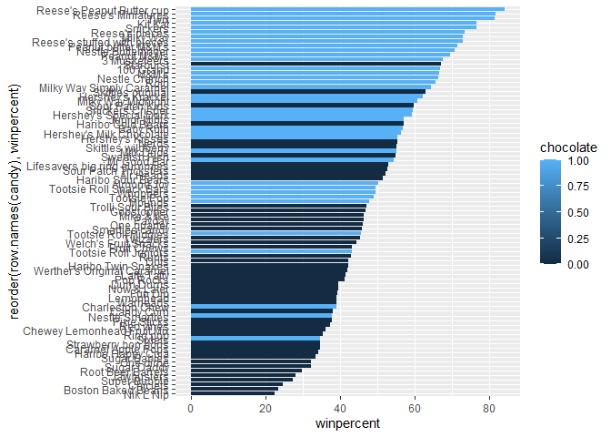
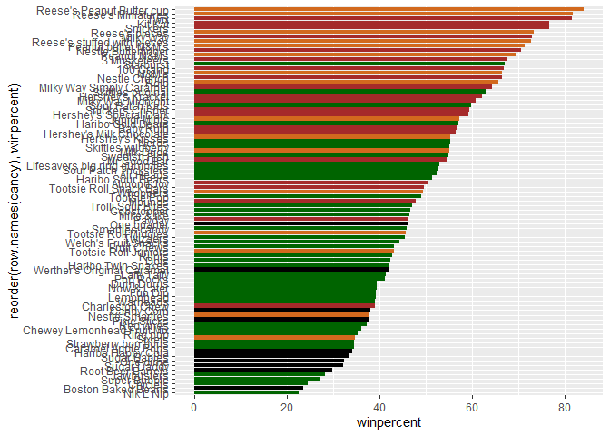
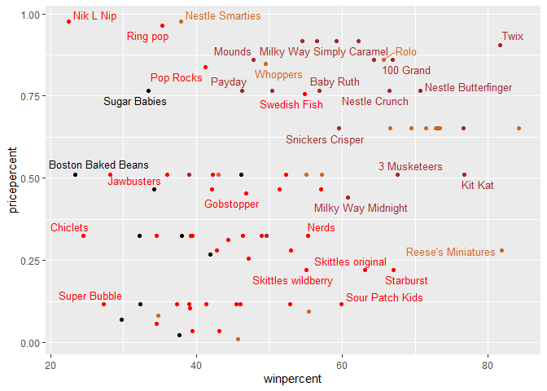
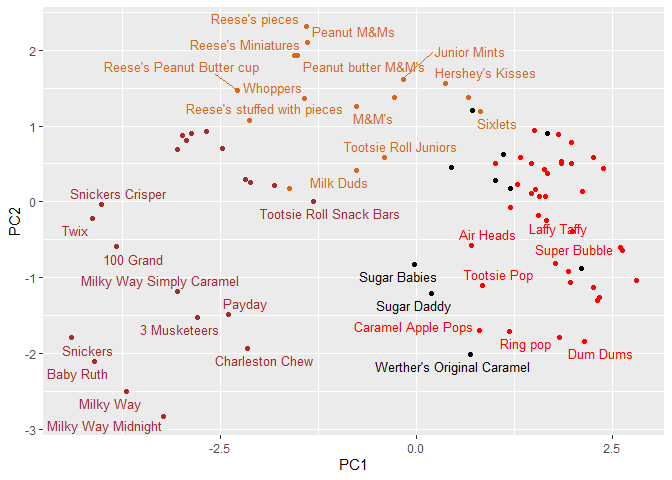
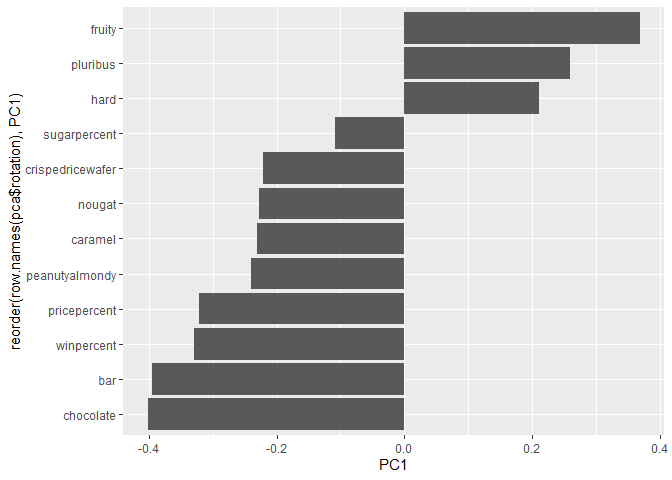

# Class 9: Candy Mini-Project
Joseph Lo (PID: A18121493)

- [Background](#background)
- [Data Import](#data-import)
- [Exploratory analysis](#exploratory-analysis)
- [Overall Candy Rankings](#overall-candy-rankings)
- [Taking a look at pricepercent](#taking-a-look-at-pricepercent)
- [Exploring the correlation
  structure](#exploring-the-correlation-structure)
- [Principal Component Analysis
  (PCA)](#principal-component-analysis-pca)
- [Summary](#summary)

## Background

In this mini-project, you will explore FiveThirtyEight’s Halloween Candy
dataset.

We will use lots of **ggplot** some basic stats, correlation analysis
and PCA to make sense of the landscape of US candy - something hopefully
more relatable than the proteomics and transcriptomics work that we will
use these methods on throughout the rest of the course.

## Data Import

Our dataset is a CSV file so we use `read.csv()`

``` r
candy <- read.csv("candy-data.txt", row.names=1)
head(candy)
```

                 chocolate fruity caramel peanutyalmondy nougat crispedricewafer
    100 Grand            1      0       1              0      0                1
    3 Musketeers         1      0       0              0      1                0
    One dime             0      0       0              0      0                0
    One quarter          0      0       0              0      0                0
    Air Heads            0      1       0              0      0                0
    Almond Joy           1      0       0              1      0                0
                 hard bar pluribus sugarpercent pricepercent winpercent
    100 Grand       0   1        0        0.732        0.860   66.97173
    3 Musketeers    0   1        0        0.604        0.511   67.60294
    One dime        0   0        0        0.011        0.116   32.26109
    One quarter     0   0        0        0.011        0.511   46.11650
    Air Heads       0   0        0        0.906        0.511   52.34146
    Almond Joy      0   1        0        0.465        0.767   50.34755

> Q1. How many different candy types are in this dataset?

``` r
nrow(candy)
```

    [1] 85

There are 85 in this dataset

> Q2. How many fruity candy types are in the dataset?

``` r
sum(candy$fruity)
```

    [1] 38

38 fruity candy types.

> Q3. What is your favorite candy (other than Twix) in the dataset and
> what is it’s winpercent value?

``` r
candy["Milky Way", "winpercent"]
```

    [1] 73.09956

``` r
library(dplyr)
```


    Attaching package: 'dplyr'

    The following objects are masked from 'package:stats':

        filter, lag

    The following objects are masked from 'package:base':

        intersect, setdiff, setequal, union

``` r
candy |> filter(row.names(candy) == "Milky Way") |>
  select(winpercent)
```

              winpercent
    Milky Way   73.09956

> Q4. What is the winpercent value for “Kit Kat”?

``` r
candy["Kit Kat", "winpercent"]
```

    [1] 76.7686

> Q5. What is the winpercent value for “Tootsie Roll Snack Bars”?

``` r
candy["Tootsie Roll Snack Bars", "winpercent"]
```

    [1] 49.6535

> Q6. Is there any variable/column that looks to be on a different scale
> to the majority of the other columns in the dataset?

Yes! Winpercent seems to be out of 100, which is very different from
other columns.

> Q7. What do you think a zero and one represent for the
> candy\$chocolate column?

``` r
candy$chocolate
```

     [1] 1 1 0 0 0 1 1 0 0 0 1 0 0 0 0 0 0 0 0 0 0 0 1 1 1 1 0 1 1 0 0 0 1 1 0 1 1 1
    [39] 1 1 1 0 1 1 0 0 0 1 0 0 0 1 1 1 1 0 1 0 0 1 0 0 1 0 1 1 0 0 0 0 0 0 0 0 1 1
    [77] 1 1 0 1 0 0 0 0 1

The 1 represents TRUE while the 0 represents FALSE.

## Exploratory analysis

> Q8. Plot a histogram of winpercent values.

``` r
hist(candy$winpercent)
```


``` r
library(ggplot2)

ggplot(candy) +
  aes(winpercent, bins=30)+
  geom_histogram()
```

    `stat_bin()` using `bins = 30`. Pick better value `binwidth`.


> Q9. Is the distribution of winpercent values symmetrical?

No, it is skewed to the left.

> Q10. Is the center of the distribution above or below 50%?

``` r
mean(candy$winpercent)
```

    [1] 50.31676

It is above 50%.

``` r
summary(candy$winpercent)
```

       Min. 1st Qu.  Median    Mean 3rd Qu.    Max. 
      22.45   39.14   47.83   50.32   59.86   84.18 

> Q11. On average is chocolate candy higher or lower ranked than fruit
> candy?

1.  Find all chocolate candy
2.  Get their winpercent values
3.  Find the mean
4.  Find all fruity candy
5.  Get their winpercent values
6.  Find the mean
7.  Compare the two means

``` r
choc.candy <- candy[candy$chocolate ==1, ]
choc.win <- choc.candy$winpercent
mean(choc.win)
```

    [1] 60.92153

``` r
fruity.candy <- candy[candy$fruity ==1, ]
fruity.win <- fruity.candy$winpercent
mean(fruity.win)
```

    [1] 44.11974

Chocolate is higher ranked than fruity candy.

> Q12. Is this difference statistically significant?

``` r
t.test(choc.win, fruity.win)
```


        Welch Two Sample t-test

    data:  choc.win and fruity.win
    t = 6.2582, df = 68.882, p-value = 2.871e-08
    alternative hypothesis: true difference in means is not equal to 0
    95 percent confidence interval:
     11.44563 22.15795
    sample estimates:
    mean of x mean of y 
     60.92153  44.11974 

Yes, they are statistically different cause p-value is less than 0.05.

## Overall Candy Rankings

> Q13. What are the five least liked candy types in this set?

``` r
y <- c("y", "a", "z")
sort(y)
```

    [1] "a" "y" "z"

``` r
y
```

    [1] "y" "a" "z"

``` r
order(y)
```

    [1] 2 1 3

``` r
ord.ind <- order(candy$winpercent)
head(candy[ord.ind, ], 5)
```

                       chocolate fruity caramel peanutyalmondy nougat
    Nik L Nip                  0      1       0              0      0
    Boston Baked Beans         0      0       0              1      0
    Chiclets                   0      1       0              0      0
    Super Bubble               0      1       0              0      0
    Jawbusters                 0      1       0              0      0
                       crispedricewafer hard bar pluribus sugarpercent pricepercent
    Nik L Nip                         0    0   0        1        0.197        0.976
    Boston Baked Beans                0    0   0        1        0.313        0.511
    Chiclets                          0    0   0        1        0.046        0.325
    Super Bubble                      0    0   0        0        0.162        0.116
    Jawbusters                        0    1   0        1        0.093        0.511
                       winpercent
    Nik L Nip            22.44534
    Boston Baked Beans   23.41782
    Chiclets             24.52499
    Super Bubble         27.30386
    Jawbusters           28.12744

> Q14. What are the top 5 all time favorite candy types out of this set?

``` r
tail(candy[ord.ind, ], 5)
```

                              chocolate fruity caramel peanutyalmondy nougat
    Snickers                          1      0       1              1      1
    Kit Kat                           1      0       0              0      0
    Twix                              1      0       1              0      0
    Reese's Miniatures                1      0       0              1      0
    Reese's Peanut Butter cup         1      0       0              1      0
                              crispedricewafer hard bar pluribus sugarpercent
    Snickers                                 0    0   1        0        0.546
    Kit Kat                                  1    0   1        0        0.313
    Twix                                     1    0   1        0        0.546
    Reese's Miniatures                       0    0   0        0        0.034
    Reese's Peanut Butter cup                0    0   0        0        0.720
                              pricepercent winpercent
    Snickers                         0.651   76.67378
    Kit Kat                          0.511   76.76860
    Twix                             0.906   81.64291
    Reese's Miniatures               0.279   81.86626
    Reese's Peanut Butter cup        0.651   84.18029

> Q15. Make a first barplot of candy ranking based on winpercent values.

``` r
ggplot(candy) + 
  aes(winpercent, rownames(candy)) +
  geom_col()
```


> Q16. This is quite ugly, use the reorder() function to get the bars
> sorted by winpercent?

``` r
ggplot(candy) + 
  aes(winpercent, reorder(rownames(candy),winpercent)) +
  geom_col()
```


``` r
ggplot(candy) +
  aes(winpercent,
      reorder(row.names(candy), winpercent),
      fill=chocolate)+
  geom_col()
```



``` r
ylab("")
```

    <ggplot2::labels> List of 1
     $ y: chr ""

We need a custom color vector

``` r
my_cols <- rep("black", nrow(candy))
my_cols[candy$chocolate==1] <- "chocolate"
my_cols[candy$bar==1] <- "brown"
my_cols[candy$fruity==1] <- "darkgreen"
my_cols
```

     [1] "brown"     "brown"     "black"     "black"     "darkgreen" "brown"    
     [7] "brown"     "black"     "black"     "darkgreen" "brown"     "darkgreen"
    [13] "darkgreen" "darkgreen" "darkgreen" "darkgreen" "darkgreen" "darkgreen"
    [19] "darkgreen" "black"     "darkgreen" "darkgreen" "chocolate" "brown"    
    [25] "brown"     "brown"     "darkgreen" "chocolate" "brown"     "darkgreen"
    [31] "darkgreen" "darkgreen" "chocolate" "chocolate" "darkgreen" "chocolate"
    [37] "brown"     "brown"     "brown"     "brown"     "brown"     "darkgreen"
    [43] "brown"     "brown"     "darkgreen" "darkgreen" "brown"     "chocolate"
    [49] "black"     "darkgreen" "darkgreen" "chocolate" "chocolate" "chocolate"
    [55] "chocolate" "darkgreen" "chocolate" "black"     "darkgreen" "chocolate"
    [61] "darkgreen" "darkgreen" "chocolate" "darkgreen" "brown"     "brown"    
    [67] "darkgreen" "darkgreen" "darkgreen" "darkgreen" "black"     "black"    
    [73] "darkgreen" "darkgreen" "darkgreen" "chocolate" "chocolate" "brown"    
    [79] "darkgreen" "brown"     "darkgreen" "darkgreen" "darkgreen" "black"    
    [85] "chocolate"

``` r
ggplot(candy) +
  aes(winpercent,
      reorder(row.names(candy), winpercent),
      )+
  geom_col(fill=my_cols)
```



``` r
ylab("")
```

    <ggplot2::labels> List of 1
     $ y: chr ""

> Q17. What is the worst ranked chocolate candy?

Sixlets

> Q18. What is the best ranked fruity candy?

Starburst

## Taking a look at pricepercent

``` r
library(ggrepel)
my_cols[candy$fruity==1] <- "red"

# How about a plot of win vs price
ggplot(candy) +
  aes(winpercent, pricepercent, label=rownames(candy)) +
  geom_point(col=my_cols) + 
  geom_text_repel(col=my_cols, size=3.3, max.overlaps = 5)
```

    Warning: ggrepel: 54 unlabeled data points (too many overlaps). Consider
    increasing max.overlaps



> Q19. Which candy type is the highest ranked in terms of winpercent for
> the least money - i.e. offers the most bang for your buck?

Reese’s Miniatures

> Q20. What are the top 5 most expensive candy types in the dataset and
> of these which is the least popular?

``` r
ord <- order(candy$pricepercent, decreasing = TRUE)
head( candy[ord,c(11,12)], n=5 )
```

                             pricepercent winpercent
    Nik L Nip                       0.976   22.44534
    Nestle Smarties                 0.976   37.88719
    Ring pop                        0.965   35.29076
    Hershey's Krackel               0.918   62.28448
    Hershey's Milk Chocolate        0.918   56.49050

Nik L Nip, Ring pop, Nestle Smarties, Herhsey’s Krackel

## Exploring the correlation structure

``` r
cij <- cor(candy)
```

``` r
library(corrplot)
```

    corrplot 0.95 loaded

``` r
corrplot(cij)
```


> Q22. Examining this plot what two variables are anti-correlated
> (i.e. have minus values)?

chocolate and fruity

> Q23. Similarly, what two variables are most positively correlated?

Chocolate and bar

## Principal Component Analysis (PCA)

``` r
pca <- prcomp(candy, scale=TRUE)
summary(pca)
```

    Importance of components:
                              PC1    PC2    PC3     PC4    PC5     PC6     PC7
    Standard deviation     2.0788 1.1378 1.1092 1.07533 0.9518 0.81923 0.81530
    Proportion of Variance 0.3601 0.1079 0.1025 0.09636 0.0755 0.05593 0.05539
    Cumulative Proportion  0.3601 0.4680 0.5705 0.66688 0.7424 0.79830 0.85369
                               PC8     PC9    PC10    PC11    PC12
    Standard deviation     0.74530 0.67824 0.62349 0.43974 0.39760
    Proportion of Variance 0.04629 0.03833 0.03239 0.01611 0.01317
    Cumulative Proportion  0.89998 0.93832 0.97071 0.98683 1.00000

Score plot…

``` r
p <- ggplot(pca$x) +
  aes(PC1, PC2, label=row.names(pca$x))+
  geom_point(col=my_cols) +
    geom_text_repel(max.overlaps=5, size=3.3, col=my_cols)

p
```

    Warning: ggrepel: 50 unlabeled data points (too many overlaps). Consider
    increasing max.overlaps



``` r
ggplot(pca$rotation) +
  aes(PC1, 
      reorder(row.names(pca$rotation), PC1)) +
  geom_col()
```



``` r
#library(plotly)
#ggplotly(p)
```

> Q24. Complete the code to generate the loadings plot above. What
> original variables are picked up strongly by PC1 in the positive
> direction? Do these make sense to you? Where did you see this
> relationship highlighted previously?

Fruity, pluribus, and hard are picked up strongly in the positive
direction. These make sense to me because they are characteristics of a
fruity candy. These features/relationships were highlighted by the
correlation plot previously.

## Summary

> Q25. Based on your exploratory analysis, correlation findings, and PCA
> results, what combination of characteristics appears to make a
> “winning” candy? How do these different analyses (visualization,
> correlation, PCA) support or complement each other in reaching this
> conclusion?

Combination of chocolate and bar seems to be the winning candy. This is
seen with the correlation plot where these two characteristics combined
had the deepest shade of blue coloring. The PCA also strongly picked up
these combinations in the negative direction, stronger than any fruity
candies. In the visualization, there were also more brown coloration and
more were in the winpercent area, indicating that chocolate is both the
majority and popularity.
