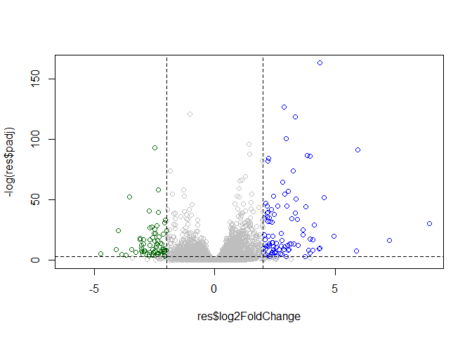
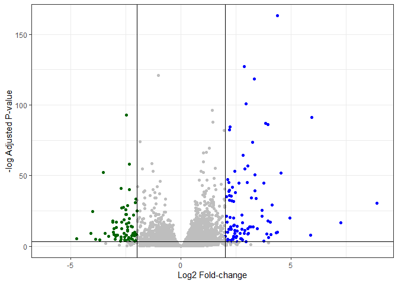
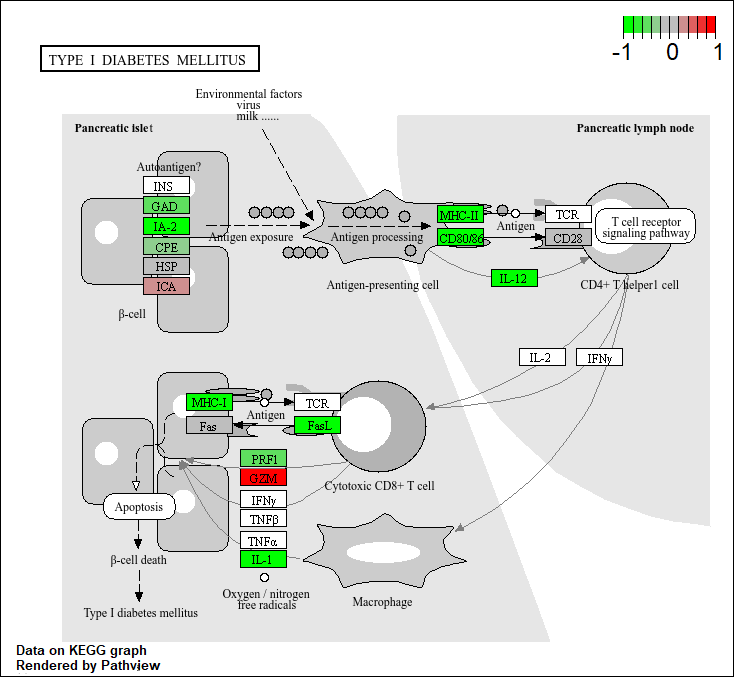

# Class 13: RNASeq with DESeq2
Joseph Lo (PID: A18121493)

- [Background](#background)
- [Data Import](#data-import)
- [Differential gene expression](#differential-gene-expression)
- [DESeq analysis](#deseq-analysis)
  - [Run the DESeq analysis pipeline](#run-the-deseq-analysis-pipeline)
- [Volcano Plot](#volcano-plot)
- [Adding some color annotation](#adding-some-color-annotation)
- [Save our results](#save-our-results)
- [Add annotation data](#add-annotation-data)
- [Save annotated results to a CSV
  file](#save-annotated-results-to-a-csv-file)
- [Pathway analysis](#pathway-analysis)

## Background

Today we will perform an RNASeq analysis of the effects of a common
steroid on airway cells.

In particular, dexamethasone (herafter just called “dex”) on different
airway smooth muscle cell lines (ASM cells).

## Data Import

We need two different inputs:

- **countData**: with genes in rows and experiments in columns
- **colData**: meta data that describes the columns in contData

``` r
counts <- read.csv("airway_scaledcounts.csv", row.names=1)
metadata <- read.csv("airway_metadata.csv")
```

We peak at counts and metadata

``` r
head(counts)
```

                    SRR1039508 SRR1039509 SRR1039512 SRR1039513 SRR1039516
    ENSG00000000003        723        486        904        445       1170
    ENSG00000000005          0          0          0          0          0
    ENSG00000000419        467        523        616        371        582
    ENSG00000000457        347        258        364        237        318
    ENSG00000000460         96         81         73         66        118
    ENSG00000000938          0          0          1          0          2
                    SRR1039517 SRR1039520 SRR1039521
    ENSG00000000003       1097        806        604
    ENSG00000000005          0          0          0
    ENSG00000000419        781        417        509
    ENSG00000000457        447        330        324
    ENSG00000000460         94        102         74
    ENSG00000000938          0          0          0

``` r
metadata
```

              id     dex celltype     geo_id
    1 SRR1039508 control   N61311 GSM1275862
    2 SRR1039509 treated   N61311 GSM1275863
    3 SRR1039512 control  N052611 GSM1275866
    4 SRR1039513 treated  N052611 GSM1275867
    5 SRR1039516 control  N080611 GSM1275870
    6 SRR1039517 treated  N080611 GSM1275871
    7 SRR1039520 control  N061011 GSM1275874
    8 SRR1039521 treated  N061011 GSM1275875

> Q1. How many genes are in this dataset?

``` r
nrow(counts)
```

    [1] 38694

38694 genes in this dataset.

> Q2. How many ‘control’ cell lines do we have?

``` r
table(metadata$dex)
```


    control treated 
          4       4 

4 controls.

## Differential gene expression

We have 4 replicate drug treated and control (no drug)
columns/experiments in our `counts` object.

We want one “mean” value for each gene (rows) in “treated” (drug) and
one nmean value for each gene in “control” cols.

Step 1. Find all “control” colums in `counts` Step 2. Extract these
columns to a new object called `control.counts` Step 3. Then calculate
the mean value for each gene

Step 1

``` r
control.inds <- metadata$dex == "control"
```

Step 2

``` r
control.counts <- counts[, control.inds]
```

Step 3

``` r
control.mean <- rowMeans(control.counts)
```

> Q. Now do the same thing for the “treated” columns/experiments…

Step 1

``` r
treated.inds <- metadata$dex == "treated"
```

Step 2

``` r
treated.counts <- counts[, treated.inds]
```

Step 3

``` r
treated.mean <- rowMeans(treated.counts)
```

Put these together for easy book-keeping as `meancounts`

``` r
meancounts <- data.frame(control.mean, treated.mean)
```

A quick plot

``` r
plot(meancounts)
```


Let’s log transform this count data:

``` r
plot(meancounts, log="xy")
```

    Warning in xy.coords(x, y, xlabel, ylabel, log): 15032 x values <= 0 omitted
    from logarithmic plot

    Warning in xy.coords(x, y, xlabel, ylabel, log): 15281 y values <= 0 omitted
    from logarithmic plot


**N.B.** We most often use log2 for this type of data as it makes the
interpretation much more straightforward.

Treated/Control is often called “fold-change”

If there was no change we would have a log2-fc of zero:

``` r
log2(10/10)
```

    [1] 0

If we had double the amount of transcript around we would have a log2-fc
of one:

``` r
log2(20/10)
```

    [1] 1

If we had half as much transcript around we would have a log2-fc of -1

``` r
log2(5/10)
```

    [1] -1

> Q. Calculate a log2 fold change value for all our genes and add it as
> a new column to our `meancounts` object.

``` r
meancounts$log2f <- log2(meancounts$treated.mean/meancounts$control.mean)


head(meancounts)
```

                    control.mean treated.mean       log2f
    ENSG00000000003       900.75       658.00 -0.45303916
    ENSG00000000005         0.00         0.00         NaN
    ENSG00000000419       520.50       546.00  0.06900279
    ENSG00000000457       339.75       316.50 -0.10226805
    ENSG00000000460        97.25        78.75 -0.30441833
    ENSG00000000938         0.75         0.00        -Inf

``` r
log2(40/10)
```

    [1] 2

There are some “funky” log2fc values (NaN and -Inf) here that come about
when ever we have 0 mean count values. Typically we would remove these
genes from any further analysis - as we can’t say anything about them if
we have no data for them.

## DESeq analysis

Let’s do this analysis with an estimate of statistical significance
using the **DESeq2** package.

``` r
library(DESeq2)
```

DESeq (like many bioconductor packages) want it’s input data in a very
specific way.

``` r
dds <- DESeqDataSetFromMatrix(countData = counts, 
                       colData=metadata,
                       design= ~dex)
```

    converting counts to integer mode

    Warning in DESeqDataSet(se, design = design, ignoreRank): some variables in
    design formula are characters, converting to factors

### Run the DESeq analysis pipeline

The main function `DESeq()`

``` r
dds <- DESeq(dds)
```

    estimating size factors

    estimating dispersions

    gene-wise dispersion estimates

    mean-dispersion relationship

    final dispersion estimates

    fitting model and testing

``` r
res <- results(dds)
head(res)
```

    log2 fold change (MLE): dex treated vs control 
    Wald test p-value: dex treated vs control 
    DataFrame with 6 rows and 6 columns
                      baseMean log2FoldChange     lfcSE      stat    pvalue
                     <numeric>      <numeric> <numeric> <numeric> <numeric>
    ENSG00000000003 747.194195     -0.3507030  0.168246 -2.084470 0.0371175
    ENSG00000000005   0.000000             NA        NA        NA        NA
    ENSG00000000419 520.134160      0.2061078  0.101059  2.039475 0.0414026
    ENSG00000000457 322.664844      0.0245269  0.145145  0.168982 0.8658106
    ENSG00000000460  87.682625     -0.1471420  0.257007 -0.572521 0.5669691
    ENSG00000000938   0.319167     -1.7322890  3.493601 -0.495846 0.6200029
                         padj
                    <numeric>
    ENSG00000000003  0.163035
    ENSG00000000005        NA
    ENSG00000000419  0.176032
    ENSG00000000457  0.961694
    ENSG00000000460  0.815849
    ENSG00000000938        NA

``` r
36000* 0.05
```

    [1] 1800

## Volcano Plot

This is a main summary results figure from these kinds of studies. It is
a plot of Log2-fold-change vs (Adjusted) P-value.

``` r
plot(res$log2FoldChange,
     res$padj)
```


Again this y-axis is highly needs log transforming and we can flip the
y-axis with a minus sign so it looks like every other volcano plot.

``` r
plot(res$log2FoldChange,
     -log(res$padj))
abline(v=-2, col="red")
abline(v=+2, col="red")
abline(h=-log(0.05), col="red")
```


## Adding some color annotation

Start with a default base color “gray”

``` r
#custom colors
mycols <- rep("gray", nrow(res))
mycols[res$log2FoldChange > 2] <- "blue"
mycols[res$log2FoldChange < -2] <- "darkgreen"
mycols[res$padj >= 0.05 ] <- "gray"

#volcano plot
plot(res$log2FoldChange,
     -log(res$padj),
     col=mycols)

#cut-off dashed lines
abline(v=c(-2,+2), lty=2)
abline(h=-log(0.05), lty=2)
```



> Q. Make a presentation quality ggplot version of this plot. Include
> cleaer axis labels, a clean theme, you custom colors, cut-off lines
> and a plot title.

``` r
library(ggplot2)

ggplot(res)+
  aes(log2FoldChange,
      -log(padj)
      )+
  geom_point(col=mycols)+
  labs(x="Log2 Fold-change",
       y="-log Adjusted P-value")+
  theme_bw() +
  geom_vline(xintercept=c(-2,2))+
  geom_hline(yintercept=-log(0.05))
```

    Warning: Removed 23549 rows containing missing values or values outside the scale range
    (`geom_point()`).



## Save our results

Write a CSV file

``` r
write.csv(res, file="results.csv")
```

## Add annotation data

We need to add missing annotation data to our main `res` results object.
This includes the common gene “symbol”

``` r
head(res)
```

    log2 fold change (MLE): dex treated vs control 
    Wald test p-value: dex treated vs control 
    DataFrame with 6 rows and 6 columns
                      baseMean log2FoldChange     lfcSE      stat    pvalue
                     <numeric>      <numeric> <numeric> <numeric> <numeric>
    ENSG00000000003 747.194195     -0.3507030  0.168246 -2.084470 0.0371175
    ENSG00000000005   0.000000             NA        NA        NA        NA
    ENSG00000000419 520.134160      0.2061078  0.101059  2.039475 0.0414026
    ENSG00000000457 322.664844      0.0245269  0.145145  0.168982 0.8658106
    ENSG00000000460  87.682625     -0.1471420  0.257007 -0.572521 0.5669691
    ENSG00000000938   0.319167     -1.7322890  3.493601 -0.495846 0.6200029
                         padj
                    <numeric>
    ENSG00000000003  0.163035
    ENSG00000000005        NA
    ENSG00000000419  0.176032
    ENSG00000000457  0.961694
    ENSG00000000460  0.815849
    ENSG00000000938        NA

We will use R and bioconductor to do this “ID mapping”

``` r
library("AnnotationDbi")
library("org.Hs.eg.db")
```

Let’s see what database we can use for translation/mapping

``` r
columns(org.Hs.eg.db)
```

     [1] "ACCNUM"       "ALIAS"        "ENSEMBL"      "ENSEMBLPROT"  "ENSEMBLTRANS"
     [6] "ENTREZID"     "ENZYME"       "EVIDENCE"     "EVIDENCEALL"  "GENENAME"    
    [11] "GENETYPE"     "GO"           "GOALL"        "IPI"          "MAP"         
    [16] "OMIM"         "ONTOLOGY"     "ONTOLOGYALL"  "PATH"         "PFAM"        
    [21] "PMID"         "PROSITE"      "REFSEQ"       "SYMBOL"       "UCSCKG"      
    [26] "UNIPROT"     

We can use the `mapIds()`function now to “translate” between any of
these databases.

``` r
res$symbol <- mapIds(org.Hs.eg.db,
                     keys=row.names(res), # Our genenames
                     keytype="ENSEMBL",        # Their format 
                     column="SYMBOL"          # Format we want
                     )
```

    'select()' returned 1:many mapping between keys and columns

> Q. Also add “ENTREZID”, “GENENAME”

``` r
res$entrez <- mapIds(org.Hs.eg.db,
                     keys=row.names(res), 
                     keytype="ENSEMBL",         
                     column="ENTREZID"          
                     )
```

    'select()' returned 1:many mapping between keys and columns

``` r
res$gename <- mapIds(org.Hs.eg.db,
                     keys=row.names(res), 
                     keytype="ENSEMBL",         
                     column="GENENAME"          
                     )
```

    'select()' returned 1:many mapping between keys and columns

``` r
head(res)
```

    log2 fold change (MLE): dex treated vs control 
    Wald test p-value: dex treated vs control 
    DataFrame with 6 rows and 9 columns
                      baseMean log2FoldChange     lfcSE      stat    pvalue
                     <numeric>      <numeric> <numeric> <numeric> <numeric>
    ENSG00000000003 747.194195     -0.3507030  0.168246 -2.084470 0.0371175
    ENSG00000000005   0.000000             NA        NA        NA        NA
    ENSG00000000419 520.134160      0.2061078  0.101059  2.039475 0.0414026
    ENSG00000000457 322.664844      0.0245269  0.145145  0.168982 0.8658106
    ENSG00000000460  87.682625     -0.1471420  0.257007 -0.572521 0.5669691
    ENSG00000000938   0.319167     -1.7322890  3.493601 -0.495846 0.6200029
                         padj      symbol      entrez                 gename
                    <numeric> <character> <character>            <character>
    ENSG00000000003  0.163035      TSPAN6        7105          tetraspanin 6
    ENSG00000000005        NA        TNMD       64102            tenomodulin
    ENSG00000000419  0.176032        DPM1        8813 dolichyl-phosphate m..
    ENSG00000000457  0.961694       SCYL3       57147 SCY1 like pseudokina..
    ENSG00000000460  0.815849       FIRRM       55732 FIGNL1 interacting r..
    ENSG00000000938        NA         FGR        2268 FGR proto-oncogene, ..

## Save annotated results to a CSV file

``` r
write.csv(res, file="results_annotated.csv")
```

## Pathway analysis

What known biological pathways do our differentially expressed genes
overlap with (i.e. play a role in)?

There lot’s of bioconductor packages to do this type of analysis.

We will use one of the oldest called **gage** along with **pathview** to
render nice pics of the pathways we find.

We can install these with the command:
`BiocManager::install( c("pathview", "gage", "gageData") )`

``` r
library(pathview)
library(gage)
library(gageData)
```

Have a wee peak what is in `gageData`

``` r
# Examine the first 2 pathways in this kegg set for humans
data(kegg.sets.hs)
head(kegg.sets.hs, 2)
```

    $`hsa00232 Caffeine metabolism`
    [1] "10"   "1544" "1548" "1549" "1553" "7498" "9"   

    $`hsa00983 Drug metabolism - other enzymes`
     [1] "10"     "1066"   "10720"  "10941"  "151531" "1548"   "1549"   "1551"  
     [9] "1553"   "1576"   "1577"   "1806"   "1807"   "1890"   "221223" "2990"  
    [17] "3251"   "3614"   "3615"   "3704"   "51733"  "54490"  "54575"  "54576" 
    [25] "54577"  "54578"  "54579"  "54600"  "54657"  "54658"  "54659"  "54963" 
    [33] "574537" "64816"  "7083"   "7084"   "7172"   "7363"   "7364"   "7365"  
    [41] "7366"   "7367"   "7371"   "7372"   "7378"   "7498"   "79799"  "83549" 
    [49] "8824"   "8833"   "9"      "978"   

The main `gage()` function that does the work wants a simple vector as
input.

``` r
foldchanges <- res$log2FoldChange
names(foldchanges) <- res$symbol
head(foldchanges)
```

         TSPAN6        TNMD        DPM1       SCYL3       FIRRM         FGR 
    -0.35070302          NA  0.20610777  0.02452695 -0.14714205 -1.73228897 

The KEGG database uses ENTREZ ids so we need to provide these in our
input vector for **gage**:

``` r
names(foldchanges) <- res$entrez
```

Now we can run `gage()`

``` r
# Get the results
keggres = gage(foldchanges, gsets=kegg.sets.hs)
```

What is in the output object `keggres`

``` r
attributes(keggres)
```

    $names
    [1] "greater" "less"    "stats"  

``` r
# Look at the first three down (less) pathways
head(keggres$less, 3)
```

                                          p.geomean stat.mean        p.val
    hsa05332 Graft-versus-host disease 0.0004250461 -3.473346 0.0004250461
    hsa04940 Type I diabetes mellitus  0.0017820293 -3.002352 0.0017820293
    hsa05310 Asthma                    0.0020045888 -3.009050 0.0020045888
                                            q.val set.size         exp1
    hsa05332 Graft-versus-host disease 0.09053483       40 0.0004250461
    hsa04940 Type I diabetes mellitus  0.14232581       42 0.0017820293
    hsa05310 Asthma                    0.14232581       29 0.0020045888

We can use the **pathview** function to render a figure of any of these
pathways along with annotation for our DEGs

Let’s see the hsa05310 Asthma pathway with out DEGs colored up:

``` r
pathview(gene.data=foldchanges, pathway.id="hsa05310")
```

    'select()' returned 1:1 mapping between keys and columns

    Info: Working in directory C:/Users/josep/OneDrive/BIMM143/bimm143_github/class13

    Info: Writing image file hsa05310.pathview.png


> Q. Can you render and insert here the pathway figure for
> “Graft-versus-host disease” and “Type I diabetes”?

Graft Versus host disease

``` r
pathview(gene.data=foldchanges, pathway.id="hsa05332")
```

    'select()' returned 1:1 mapping between keys and columns

    Info: Working in directory C:/Users/josep/OneDrive/BIMM143/bimm143_github/class13

    Info: Writing image file hsa05332.pathview.png


Type I diabetes

``` r
pathview(gene.data=foldchanges, pathway.id="hsa04940")
```

    'select()' returned 1:1 mapping between keys and columns

    Info: Working in directory C:/Users/josep/OneDrive/BIMM143/bimm143_github/class13

    Info: Writing image file hsa04940.pathview.png


