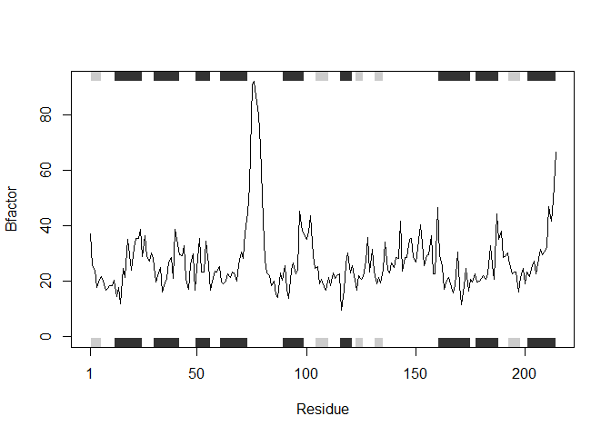
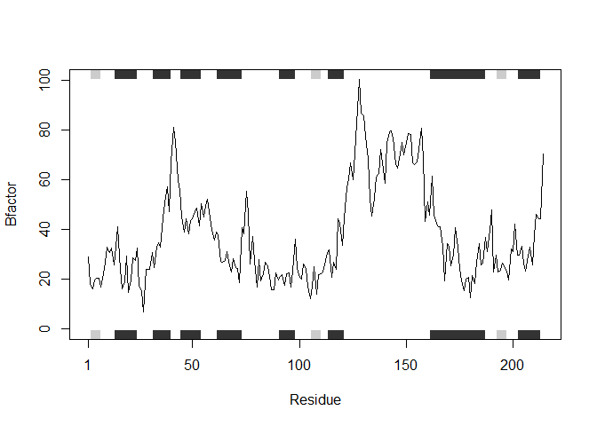

# Class 6 function homework
Joseph Lo PID: A18121493

``` r
# Can you improve this analysis code?
library(bio3d) 

s1 <- read.pdb("4AKE") # kinase with drug
```

      Note: Accessing on-line PDB file

``` r
s2 <- read.pdb("1AKE") # kinase no drug
```

      Note: Accessing on-line PDB file
       PDB has ALT records, taking A only, rm.alt=TRUE

``` r
s3 <- read.pdb("1E4Y") # kinase with drug
```

      Note: Accessing on-line PDB file

``` r
s1.chainA <- trim.pdb(s1, chain="A", elety="CA")
s2.chainA <- trim.pdb(s2, chain="A", elety="CA")
s3.chainA <- trim.pdb(s1, chain="A", elety="CA")

s1.b <- s1.chainA$atom$b
s2.b <- s2.chainA$atom$b
s3.b <- s3.chainA$atom$b

plotb3(s1.b, sse=s1.chainA, typ="l", ylab="Bfactor")
```


``` r
plotb3(s2.b, sse=s2.chainA, typ="l", ylab="Bfactor")
```



``` r
plotb3(s3.b, sse=s3.chainA, typ="l", ylab="Bfactor")
```



> Q6. How would you generalize the original code above to work with any
> set of input protein structures?

``` r
plot_protein <- function(x){
  s1 <- read.pdb(x)
  s1.chainA <- trim.pdb(s1, chain="A", elety="CA")
  s1.b <- s1.chainA$atom$b
  plotb3(s1.b, sse=s1.chainA, typ="l", ylab="Bfactor")
}
```

# Example output

``` r
plot_protein("1AKE")
```

      Note: Accessing on-line PDB file

    Warning in get.pdb(file, path = tempdir(), verbose = FALSE):
    C:\Users\josep\AppData\Local\Temp\Rtmpaepw84/1AKE.pdb exists. Skipping download

       PDB has ALT records, taking A only, rm.alt=TRUE


